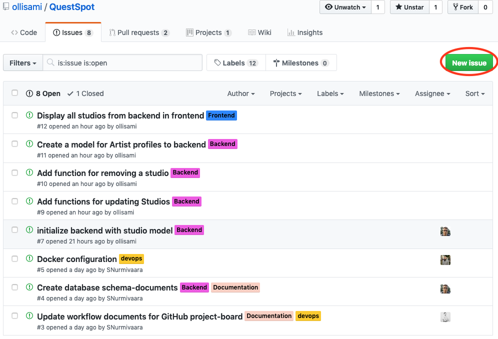
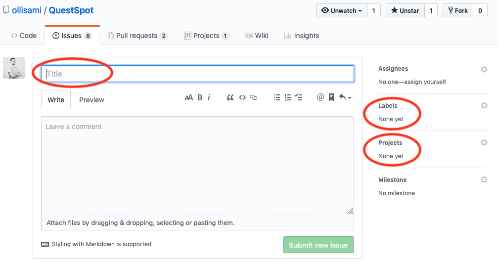
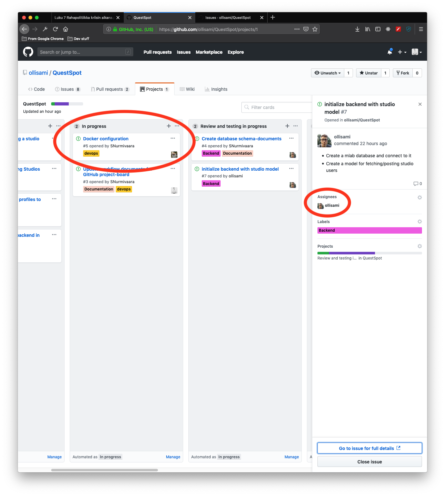
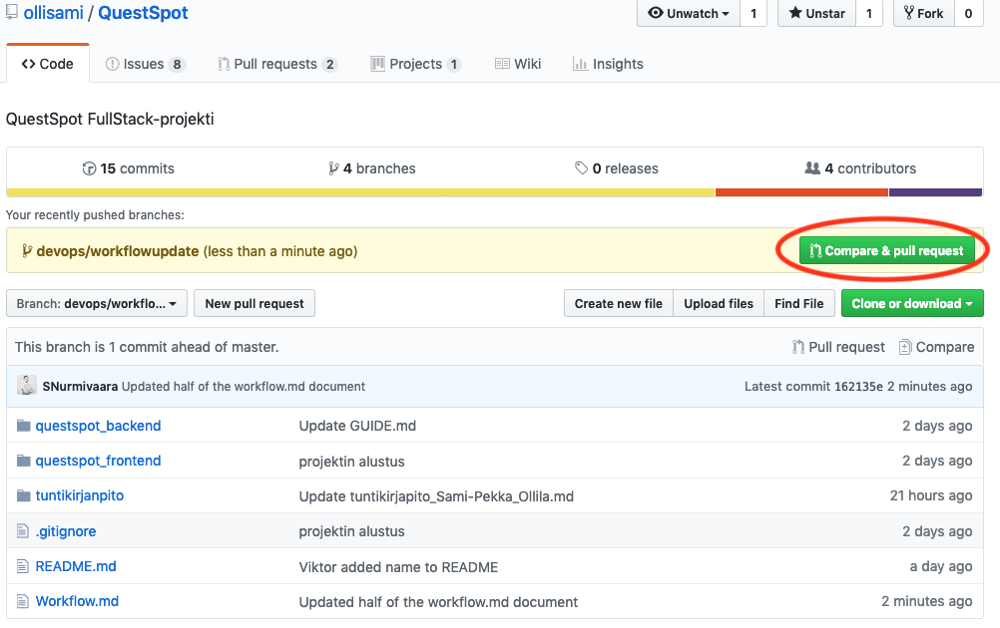
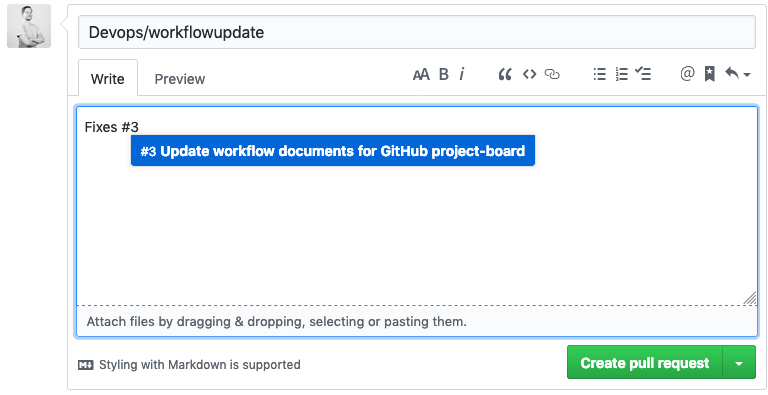
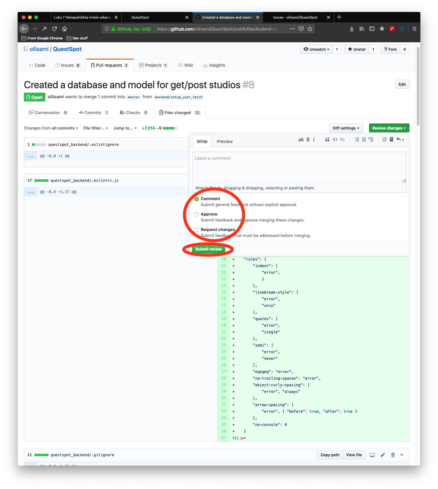

# Workflow

## Creating a new issue/task

- On GitHub  navigate to "Issues" tab and press "New issue" -button.

- Give issue AT LEAST the following information:
  - Title: title of the issue eg. "Update header H1 style"
  - Label: frontend/backend/devops and more precise labels if applicable
  - Projects: Tag the issue as related to QuestSpot -project.
  - Other fields are optional, if you instantly start to work on the said issue you can assign yourself.
- Press "Submit new issue"

## Doing a task

- On GitHub navigate to "Projects" -> "QuestSpot"
- Move desired task from "To Do" to "In Progress"
- Click the task card and assign yourself to it

- Update labels if needed
- On your machine run **git status** and make sure it returns "nothing to commit, working tree clean"
- Run **git pull**
- Create new branch and checkout it with **git checkout -b xxx/yyy** where xxx is either frontend/backend/devops and yyy is a short descriptive name in the style of the issue this feature branch is related to eg. frontend/h1stylefix
- Do desired changes and use normal git workflow of **add** and **commit**. Make sure to make good commit messages.
- Make sure nothing breaks, your code is clean and ES-Lint is happy.
- push to the branch with **git push origin xxx/yyy**, where xxx/yyy is the branch name which you chose. MAKE SURE YOU ARE ON THE CORRECT BRANCH, DO NOT PUSH TO MASTER.
- Go back to github, you should see "Your recently pushed branches:" on the front page of the project.
- Press "Compare & Pull request"

- Fill in the pull request and reference the issue ticket number which your pull request is fixing. eg "This fixes issue #3" if the ticket number is 3.

- Move the issue in the projects -> questspot to the column "Review and testing in progress"
- Mark your spent hours in your personal hour booking.

## Task review and testing

- Pick a task from the Projects -> QuestSpot projectboard to review&test by clicking the card and pressing "Go to issue for full details"
- View the commit history, and go to the pull request.
- Assign yourself as a reviewer and do a pull review and run applicable tests, if the are some. In most cases switching to the applicable branch and testing locally is needed.
  - This is done by **git checkout xxx/yyy** where xxx/yyy is the branch of the pull request.
- If there is something that you want clarified use "comment" on the pull review.
- If there is something that you want fixed use "Request changes"  on the pull review
- Otherwise mark "Approve", leave a comment and submit your review
- After everything works as intended and you feel the code is up to standards, finish the review and press "Merge pull request"

- Mark your spent hours in your personal hour booking.
